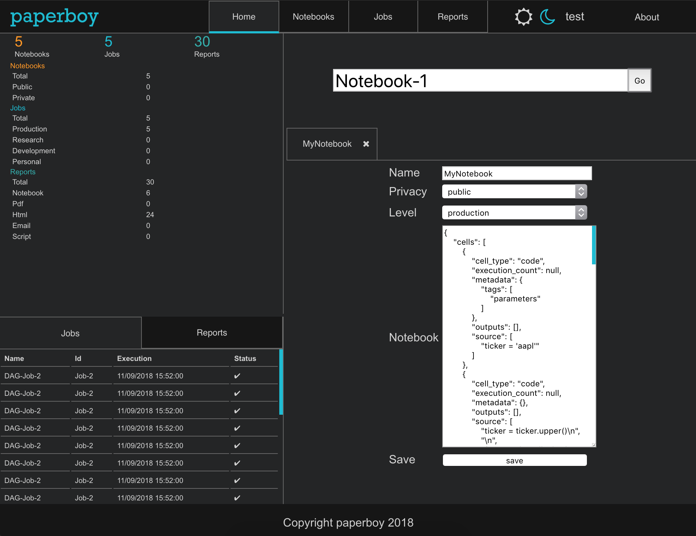

.. paperboy documentation master file, created by
   sphinx-quickstart on Fri Jan 12 22:07:11 2018.
   You can adapt this file completely to your liking, but it should at least
   contain the root `toctree` directive.

paperboy
========

.. figure:: https://img.shields.io/badge/Status-BETA%201-yellow.svg?&longCache=true&style=for-the-badge
   :alt: Status

A web frontend for scheduling Jupyter Notebooks as reports

.. toctree::
   :maxdepth: 2
   :caption: Contents:

   installation
   quickstart

Overview
========

|Build Status|
|https://ci.appveyor.com/api/projects/status/32r7s2skrgm9ubva?svg=true|
|Waffle.io| |Coverage| |Docs| |Site|

Paperboy is a production-grade application for scheduling reports. It
has a flexible architecture and extensible APIs, and can integrate into
a wide variety of deployments. It is composed of various
industrial-strength technologies from the open source world.

-  `Jupyter Notebooks <https://jupyter.org/documentation>`__ for the
   reports themselves

   -  Jupyter notebooks are an ideal report template, and with
      `NBConvert <https://github.com/jupyter/nbconvert>`__ support a
      wide variety of output types, including PDFs, HTML, Emails, etc

-  `Papermill <https://github.com/nteract/papermill>`__ to parameterize
   notebooks
-  `SQLAlchemy <https://www.sqlalchemy.org>`__ for Storage
-  `Apache Airflow <https://airflow.apache.org>`__ for Scheduling
-  `Dask <https://dask.org>`__ for `Airflow
   Workers <https://airflow.readthedocs.io/en/stable/howto/executor/use-dask.html>`__
-  `Kubernetes <https://kubernetes.io>`__ for worker instances
-  `PhosphorJS <https://phosphorjs.github.io>`__ for the frontend
-  Support for Python
   `Virtualenvs <https://virtualenv.pypa.io/en/stable/>`__ via
   ``requirements.txt`` or custom `Docker <https://www.docker.com>`__
   images via ``Dockerfile``\ s on a per-notebook level

Some future options include:

-  MongoDB storage
-  Luigi scheduler

|image6|

Process Flow
------------

-  Upload notebook
-  Configure job

   -  start time
   -  interval
   -  papermill parameters to autoconfigure reports
   -  if autoconfiguring reports from papermill:

      -  run or publish
      -  output

         -  notebook
         -  pdf
         -  html
         -  email
         -  script

      -  strip or keep code

-  To edit or create additional reports on a job, configure reports

   -  run or publish
   -  output

      -  notebook
      -  pdf
      -  html
      -  email
      -  script

   -  strip or keep code

Storage Arch
------------

|image7|

Parameters demo
---------------

|image8|

Airflow Integration
-------------------

|image9| |image10| |image11| |image12| |image13| |image14| |image15|
|image16| |image17| |image18|

.. |Build Status| image:: https://travis-ci.org/timkpaine/paperboy.svg?branch=master
   :target: https://travis-ci.org/timkpaine/paperboy
.. |https://ci.appveyor.com/api/projects/status/32r7s2skrgm9ubva?svg=true| image:: https://ci.appveyor.com/api/projects/status/32r7s2skrgm9ubva?svg=true
.. |Waffle.io| image:: https://badge.waffle.io/timkpaine/paperboy.png?label=ready&title=Ready
   :target: https://waffle.io/timkpaine/paperboy?utm_source=badge
.. |Coverage| image:: https://codecov.io/gh/timkpaine/paperboy/branch/master/graph/badge.svg
   :target: https://codecov.io/gh/timkpaine/paperboy
.. |Docs| image:: https://img.shields.io/readthedocs/paperboy.svg
   :target: https://paperboy.readthedocs.io
.. |Site| image:: https://img.shields.io/badge/Site--grey.svg?colorB=FFFFFF
   :target: https://paperboy-jp.herokuapp.com/

.. |image7| image:: ./img/arch.png
.. |image8| image:: ./img/demo.gif
.. |image9| image:: ./img/notebook.png
.. |image10| image:: ./img/job.png
.. |image11| image:: ./img/reports.png
.. |image12| image:: ./img/dag.png
.. |image13| image:: ./img/dag_init.png
.. |image14| image:: ./img/dag_papermill.png
.. |image15| image:: ./img/dag_nbconvert.png
.. |image16| image:: ./img/dag_cleanup.png
.. |image17| image:: ./img/dag_out.png
.. |image18| image:: ./img/reports_demo.png

